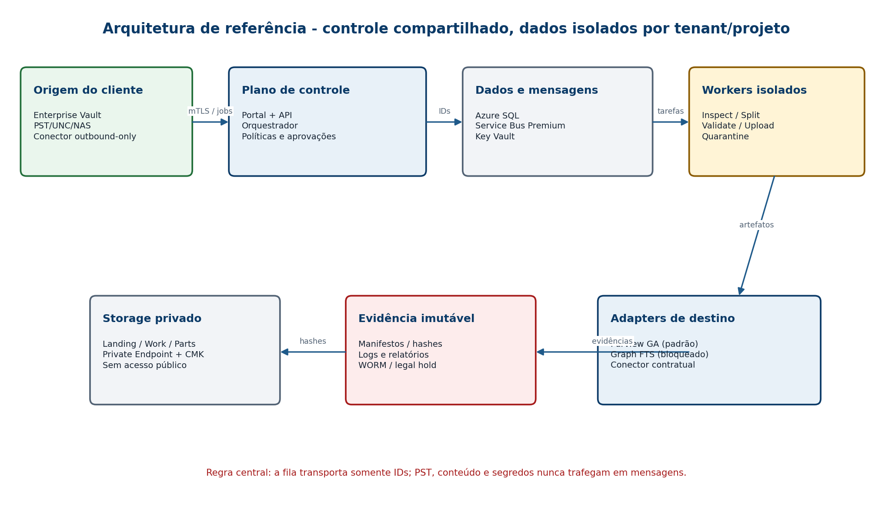
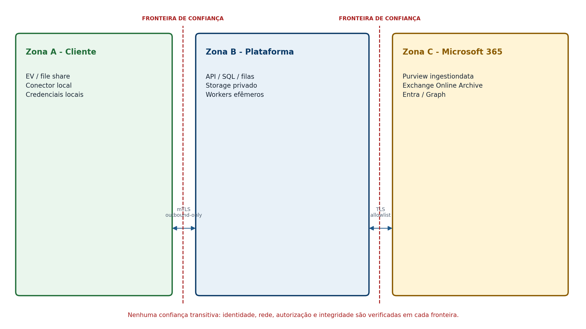
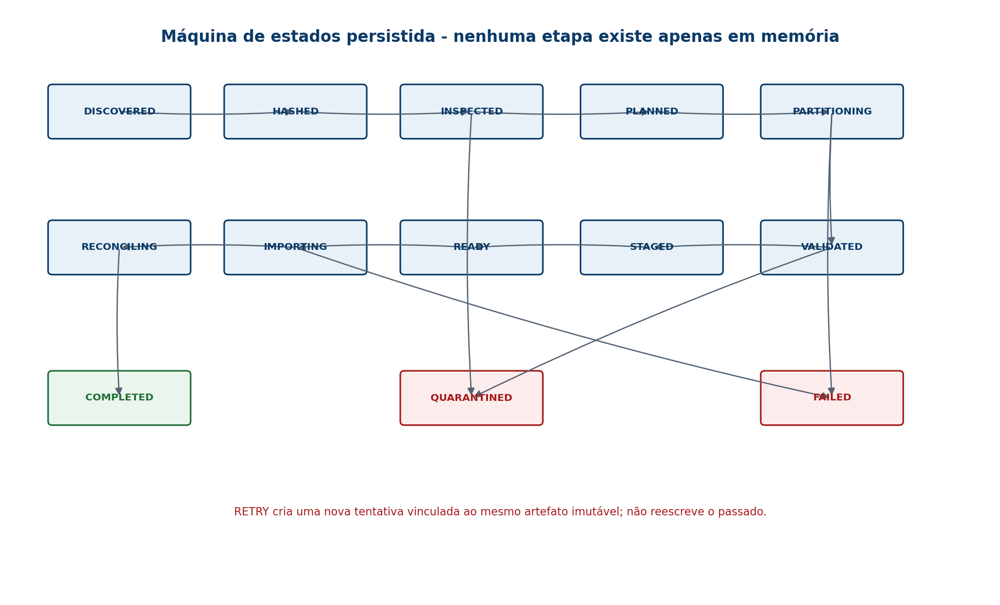

<!-- Gerado por tools/convert_runbook.py a partir de docs/source/Runbook_Engenharia_Plataforma_Migracao_EV_PST_M365.docx. Não editar manualmente: alterações devem ser feitas no DOCX e reconvertidas. -->

# Parte II - Arquitetura e organização do software

## 6. Princípios arquiteturais

11. **Monólito modular no plano de controle.** Um deployable coeso com módulos e limites internos explícitos reduz custo transacional e evita microsserviços prematuros. Workers pesados continuam processos separados.
12. **Arquitetura hexagonal.** Domínio não conhece Azure SDK, Aspose, Veritas, Purview ou Graph. Interfaces vivem em `Application`; adapters vivem em `Infrastructure`.
13. **Artefatos imutáveis.** PST de origem, PST part aprovado, manifesto e evidência ganham hash e não são editados. Nova versão cria novo ID e vínculo de derivação.
14. **At-least-once técnico, exactly-once de efeito.** Service Bus pode entregar novamente; Inbox, Outbox, unique constraints e idempotency key impedem efeito duplicado.
15. **Fail closed.** Ausência de licença, capacidade, hash, identidade, consentimento ou evidência bloqueia avanço.
16. **Dados mínimos.** O plano de controle guarda metadados; conteúdo de e-mail permanece nos artefatos protegidos.
17. **Operação humana explícita.** Etapas que dependem do portal são tarefas de workflow, não cliques fora do sistema.
18. **Compatibilidade como capability.** Preview, região, nuvem nacional, tenant e versão são avaliados antes de criar job.
19. **Configuração versionada.** Toda política que muda resultado da migração tem versão e hash.
20. **Segurança verificável.** “Criptografado” ou “imutável” precisa de configuração, teste e evidência.



## 7. Componentes e responsabilidades

| **Componente** | **Responsabilidade** | **Proibições** |
| --- | --- | --- |
| Operator Portal | planejamento, aprovação, acompanhamento e evidência | não processa PST; não exibe corpo/anexo por padrão |
| Control API | contratos REST, autorização, validação e idempotência | não chama biblioteca PST no request thread |
| Orchestrator | state machine, policy gates, scheduling, sagas | não lê bytes do PST |
| Source Connector | inventário EV, export e transferência outbound | não recebe conexão inbound da plataforma |
| PST Worker | hash, inspeção, partição, validação primária | não possui permissão de Exchange/Purview |
| Independent Validator | segunda engine e verificação de manifesto | não altera artefato validado |
| Upload Worker | AzCopy e adapter de destino | não tem acesso ao PST original se apenas part é necessário |
| Reconciliation Worker | agrega resultados e consulta estatísticas | não marca job como concluído sozinho |
| Evidence Service | empacota, assina e publica evidências WORM | não permite overwrite/delete por operador |
| Azure SQL | estado transacional, locks, outbox/inbox | não armazena SAS, corpo ou anexo |
| Service Bus | comandos assíncronos e eventos | mensagem ≤ envelope; nenhum conteúdo bruto |
| Private Storage | landing, work, parts, quarantine | acesso público desabilitado |
| Microsoft 365 Adapter | precheck, mapping, upload e resultado | nenhuma chamada não suportada |

### 7.1 Unidades de implantação

- `control-api`: ASP.NET Core, duas ou mais réplicas, health endpoints separados para liveness/readiness.
- `control-orchestrator`: .NET Worker, singleton lógico por lock distribuído para cada job.
- `portal-web`: aplicação web com autenticação Entra; pode ser Blazor ou React. A decisão recomendada é React/TypeScript se o time já dominar; caso contrário, Blazor reduz stack.
- `pst-worker-windows`: serviço Windows em VM Scale Set dedicado, sem inbound público.
- `source-connector-windows`: serviço instalado no ambiente do cliente, registrado por certificado e mTLS.
- `upload-worker-windows`: imagem separada para AzCopy e rede de saída Microsoft 365.
- `recon-worker`: worker leve, sem acesso ao landing original.
- `evidence-signer`: função restrita com identidade própria e acesso apenas ao container de evidência.

### 7.2 Topologia de rede

- uma VNet por ambiente (`dev`, `test`, `prod`);
- subnets separadas para ingress, apps, workers, private endpoints e management;
- Network Security Groups negando tráfego lateral por padrão;
- Private DNS Zones para SQL, Storage, Service Bus, Key Vault e Container Registry;
- Azure Firewall ou NVA para egress allowlist e logging;
- nenhuma VM com IP público; administração por Azure Bastion/JIT/PIM;
- source connector estabelece HTTPS/mTLS outbound; nenhuma porta inbound criada no cliente;
- upload Purview usa endpoint Microsoft fornecido no SAS e precisa ser tratado como exceção de egress auditada;
- DNS e relógio são dependências críticas; NTP drift acima de dois minutos gera alerta e bloqueia operações assinadas.



## 8. Estrutura do repositório

O repositório deverá ser único enquanto o produto for um monólito modular. Pastas de adapters deixam claro onde dependências de fornecedor podem existir.

```text
/src
  /Control.Api
  /Control.Orchestrator
  /Portal.Web
  /Modules
    /Tenancy
      /Domain
      /Application
      /Infrastructure
    /Projects
    /Sources
    /PstProcessing
    /Planning
    /Destinations
    /Reconciliation
    /Evidence
    /Operations
  /Workers
    /Pst.Worker
    /Pst.Validator
    /Upload.Worker
    /Reconciliation.Worker
    /SourceConnector.Worker
  /Adapters
    /Pst.Aspose
    /Pst.LibPff
    /Source.EnterpriseVault
    /Target.Purview
    /Target.GraphFts
    /Storage.AzureBlob
    /Messaging.AzureServiceBus
    /Identity.Entra
/tests
  /Unit
  /Architecture
  /Contract
  /Integration
  /Compatibility
  /Performance
  /Chaos
  /Security
  /TestDataBuilder
/infra
  /bicep
    main.bicep
    /modules
    /environments
  /policies
  /scripts
/ops
  /dashboards
  /alerts
  /runbooks
  /kql
/docs
  /adr
  /threat-model
  /api
  /schemas
  /support-matrix
/build
  Directory.Build.props
  Directory.Packages.props
  dotnet-tools.json
  NuGet.Config
global.json
Directory.Build.props
Directory.Packages.props
PstMigration.slnx
SECURITY.md
CONTRIBUTING.md
CODEOWNERS
LICENSES-THIRD-PARTY.md
```

### 8.1 Regras de dependência

- `Domain` depende apenas de BCL e shared kernel mínimo.
- `Application` depende de `Domain`, contratos e abstrações.
- `Infrastructure/Adapters` dependem de SDKs externos e implementam abstrações.
- `Api/Workers` são composition roots.
- módulo A não referencia a infraestrutura do módulo B.
- nenhum projeto, exceto `Adapters/Pst.Aspose`, referencia `Aspose.Email`.
- nenhum projeto, exceto `Target.Purview`, conhece o schema CSV Purview.
- `GraphFts` compila, mas permanece inacessível se o capability gate não estiver aprovado.
- testes de arquitetura falham o build quando uma regra é violada.

## 9. Registros de decisão arquitetural antes do código

Criar estes ADRs em `docs/adr` e aprová-los em pull request. O código só começa após ADR-0001 a ADR-0008.

| **ADR** | **Decisão** | **Gate** |
| --- | --- | --- |
| ADR-0001 | monólito modular + workers separados | arquiteto + tech lead |
| ADR-0002 | .NET 10 LTS e política de atualização | segurança + plataforma |
| ADR-0003 | Azure SQL + Service Bus Premium | arquitetura + FinOps |
| ADR-0004 | Aspose como writer/splitter primário | PoC de biblioteca, licença e jurídico |
| ADR-0005 | libpff somente como verificador independente | compatibilidade e LGPL avaliadas |
| ADR-0006 | Purview como adapter GA inicial | evidência oficial e teste em tenant controlado |
| ADR-0007 | Graph FTS bloqueado | reavaliação quando archive/FTS estiverem suportados |
| ADR-0008 | modelo de isolamento por tenant/projeto | segurança e DPO |
| ADR-0009 | estratégia de fingerprint por item | performance + privacidade |
| ADR-0010 | assinatura de evidência e WORM | jurídico + segurança |
| ADR-0011 | portal React ou Blazor | time responsável |
| ADR-0012 | single-region com DR ou active/passive | negócio + custo |

## 10. Preparação da estação do desenvolvedor

Os comandos abaixo assumem Windows 11/Windows Server com PowerShell 7 elevado somente durante instalação. O desenvolvimento diário ocorre sem privilégio administrativo.

```powershell
# Instalar ferramentas aprovadas. Ajustar IDs se o catálogo corporativo usar winget privado.
winget install --id Git.Git -e
winget install --id Microsoft.PowerShell -e
winget install --id Microsoft.DotNet.SDK.10 -e
winget install --id Microsoft.AzureCLI -e
winget install --id Microsoft.Azure.StorageExplorer -e
winget install --id Microsoft.VisualStudioCode -e
winget install --id Docker.DockerDesktop -e

# Confirmar versões. O pipeline deve repetir essas verificações.
git --version
pwsh --version
dotnet --info
az version
docker version
```

Instalar Bicep pelo Azure CLI e fixar o SDK .NET no `global.json`.

```powershell
az bicep install
az bicep version

New-Item -ItemType Directory -Path C:\src\pst-migration -Force | Out-Null
Set-Location C:\src\pst-migration
git init --initial-branch main
dotnet new globaljson --sdk-version <VERSAO_10_LTS_APROVADA> --roll-forward latestPatch
dotnet new sln --name PstMigration --format slnx
```

> [!NOTE]
> **CONTROLE DE SEGURANÇA**
> Não usar `az login` com conta Global Administrator. A assinatura de desenvolvimento deve ser separada, sem dados reais, e o desenvolvedor recebe apenas Contributor no resource group efêmero. Produção usa pipeline OIDC/workload identity, não segredo de service principal.

### 10.1 Scaffolding do código

```powershell
$projects = @(
  @{ Template='webapi'; Name='Control.Api' },
  @{ Template='worker'; Name='Control.Orchestrator' },
  @{ Template='worker'; Name='Workers.Pst' },
  @{ Template='worker'; Name='Workers.Validator' },
  @{ Template='worker'; Name='Workers.Upload' },
  @{ Template='worker'; Name='Workers.Reconciliation' },
  @{ Template='worker'; Name='Workers.SourceConnector' },
  @{ Template='classlib'; Name='SharedKernel' },
  @{ Template='classlib'; Name='Modules.Tenancy' },
  @{ Template='classlib'; Name='Modules.Projects' },
  @{ Template='classlib'; Name='Modules.Sources' },
  @{ Template='classlib'; Name='Modules.PstProcessing' },
  @{ Template='classlib'; Name='Modules.Planning' },
  @{ Template='classlib'; Name='Modules.Destinations' },
  @{ Template='classlib'; Name='Modules.Reconciliation' },
  @{ Template='classlib'; Name='Modules.Evidence' },
  @{ Template='classlib'; Name='Adapters.Pst.Aspose' },
  @{ Template='classlib'; Name='Adapters.Source.EnterpriseVault' },
  @{ Template='classlib'; Name='Adapters.Target.Purview' },
  @{ Template='classlib'; Name='Adapters.Target.GraphFts' }
)

foreach ($p in $projects) {
  $path = Join-Path 'src' $p.Name
  dotnet new $p.Template --name $p.Name --output $path --framework net10.0
  dotnet sln PstMigration.slnx add "$path\$($p.Name).csproj"
}

$testProjects = 'Unit.Tests','Architecture.Tests','Contract.Tests','Integration.Tests','Compatibility.Tests'
foreach ($name in $testProjects) {
  $path = Join-Path 'tests' $name
  dotnet new xunit --name $name --output $path --framework net10.0
  dotnet sln PstMigration.slnx add "$path\$name.csproj"
}

dotnet new editorconfig
dotnet new gitignore
dotnet restore
dotnet build --configuration Release --no-restore
dotnet test --configuration Release --no-build
```

### 10.2 Gerenciamento central de pacotes

Ativar `ManagePackageVersionsCentrally` em `Directory.Packages.props`. Toda versão é exata, revisada e atualizada por pull request automatizado. Não usar wildcard em produção. O primeiro PR de dependências deve conter no mínimo:

- `Microsoft.EntityFrameworkCore.SqlServer` e `Design` na linha 10;
- `Azure.Identity`, `Azure.Messaging.ServiceBus`, `Azure.Storage.Blobs`, `Azure.Security.KeyVault.Secrets`;
- `Microsoft.Graph` somente no adapter Graph;
- `Aspose.Email` somente no adapter Aspose e após licença;
- `OpenTelemetry.Extensions.Hosting`, exporter OTLP e instrumentações;
- `Serilog.AspNetCore` se Serilog for escolhido;
- `FluentValidation.DependencyInjectionExtensions` ou validação equivalente;
- `Microsoft.AspNetCore.OpenApi`;
- `NetArchTest.Rules` ou ferramenta equivalente nos testes de arquitetura;
- `Testcontainers.MsSql`, `Testcontainers.ServiceBus` quando aplicável;
- `WireMock.Net` para contratos HTTP controlados.

```powershell
# Exemplo: adicionar pacote sem espalhar versão no csproj.
dotnet add src\Adapters.Target.Purview\Adapters.Target.Purview.csproj package Azure.Identity
dotnet add src\Adapters.Target.Purview\Adapters.Target.Purview.csproj package Azure.Storage.Blobs
dotnet add src\Adapters.Pst.Aspose\Adapters.Pst.Aspose.csproj package Aspose.Email

# Fixar lock files e exigir restore determinístico.
dotnet restore --use-lock-file
dotnet restore --locked-mode
```

### 10.3 Hooks locais e qualidade

```powershell
dotnet new tool-manifest
dotnet tool install dotnet-format
dotnet tool install dotnet-outdated-tool
dotnet format --verify-no-changes
dotnet list package --vulnerable --include-transitive
dotnet list package --outdated
```

O pipeline bloqueia merge quando houver warning tratado como error, dependência crítica vulnerável, formato divergente, teste falho, cobertura inferior ao gate do módulo ou alteração de infraestrutura sem `what-if`.

## 11. Modelo de domínio e invariantes

### 11.1 Agregados principais

| **Agregado** | **Responsabilidade** | **Invariantes críticas** |
| --- | --- | --- |
| `Tenant` | isolamento, região, chaves, consentimento | nenhum recurso sem tenant; estado suspenso bloqueia execução |
| `MigrationProject` | política e escopo | policy version imutável após primeiro import |
| `MailboxTarget` | identidade, licença, archive, quota | um owner lógico por target; GUID sempre que possível |
| `SourceObject` | artefato de origem | hash/tamanho imutáveis depois de `HASHED` |
| `PstInspection` | inventário estrutural | refere exatamente um source hash |
| `PartitionPlan` | decisão determinística de divisão | hash da policy + source hash + engine version |
| `PstPart` | parte gerada | bytes nunca mudam após `VALIDATED` |
| `ImportWave` | conjunto atômico operacional | uma part aparece no máximo uma vez por target/root |
| `DestinationRun` | execução em provider | provider/capability fixados no início |
| `Reconciliation` | comparação e desvios | não fecha com exceção sem disposition |
| `CustodyEvent` | evento append-only | sem update/delete; sequência e hash encadeados |
| `EvidencePackage` | prova final | manifesto, assinatura e URI WORM |

### 11.2 Value objects

- `TenantId`, `ProjectId`, `JobId`, `ArtifactId`, `MailboxId` como tipos fortes.
- `Sha256Digest` aceita exatamente 64 caracteres hex normalizados.
- `ByteSize` usa `long`, nunca `int`, e expõe GB/GiB separadamente.
- `NormalizedPath` rejeita `..`, ADS, device path, wildcard e path fora da raiz permitida.
- `TargetRootFolder` exige `/NomeSeguro`, nunca `/`, e normaliza Unicode.
- `EmailAddress` não é usado como identidade imutável; `ExchangeGuid`/object ID é preferido.
- `PolicyVersion` e `EngineVersion` entram na identidade de derivação.
- `IdempotencyKey` é opaca, de alta entropia, com escopo de tenant.

### 11.3 Máquina de estados



| **Estado** | **Entrada exigida** | **Saída normal** | **Quem pode transicionar** |
| --- | --- | --- | --- |
| DISCOVERED | source registrado | HASHED | orchestrator |
| HASHED | hash + tamanho + URI | INSPECTED | PST worker |
| INSPECTED | inventário + risk score | PLANNED ou QUARANTINED | policy engine |
| PLANNED | plan hash + capacidade | PARTITIONING | approver/orchestrator |
| PARTITIONING | lease exclusivo | VALIDATED ou FAILED | PST worker |
| VALIDATED | validação dupla | STAGED | validator |
| STAGED | blob/artefato + hash | READY | upload worker |
| READY | prechecks e pacote | IMPORTING | operador + aprovador |
| IMPORTING | provider run ID | RECONCILING ou FAILED | target adapter |
| RECONCILING | resultados coletados | COMPLETED ou QUARANTINED | recon worker + approver |
| COMPLETED | evidência assinada | terminal | evidence service |
| QUARANTINED | motivo e owner | nova tentativa ou terminal | especialista + aprovador |
| FAILED | erro classificado | retry controlado ou terminal | orchestrator |

### 11.4 Transições proibidas

- `DISCOVERED → IMPORTING`.
- `VALIDATED → PARTITIONING` no mesmo artifact ID.
- `COMPLETED → qualquer estado`.
- `QUARANTINED → READY` sem nova validação.
- `FAILED → estado anterior` sem nova `Attempt`.
- alteração de `TargetRootFolder` após qualquer import iniciado.
- regeneração de part com mesmo `PartId` e hash diferente.
- substituição de evidência publicada; correção cria pacote sucessor.

## 12. Persistência, concorrência e esquema de banco

Azure SQL é o sistema de registro do controle. Blob é o sistema de registro dos artefatos. Service Bus não é banco. O modelo deve usar `rowversion` para concorrência otimista, `tenant_id` em todas as tabelas e índices que começam por tenant nos acessos multitenant.

### 12.1 Tabelas mínimas

| **Tabela** | **Conteúdo** | **Retenção** |
| --- | --- | --- |
| `tenants` | identidade, estado, região | vida do contrato + política |
| `projects` | escopo, policy hash, classificações | permanente de auditoria |
| `mailbox_targets` | GUID, UPN mascarado, archive/licença/capacidade | projeto + retenção |
| `source_objects` | URI lógica, hash, bytes, owner | projeto + retenção |
| `pst_inspections` | métricas estruturais e risco | projeto + retenção |
| `partition_plans` | algoritmo, policy, engine e hash | permanente de auditoria |
| `pst_parts` | artifact URI, hash, count, dates | projeto + retenção |
| `import_waves` | target, root, provider, bytes, estado | permanente de auditoria |
| `wave_parts` | vínculo único part/target/root | permanente de auditoria |
| `attempts` | tentativa, erro, retry, tempo | suporte e auditoria |
| `checkpoints` | estágio, cursor opaco, lease | até conclusão + período |
| `recon_results` | esperado, observado, desvio | permanente de auditoria |
| `custody_events` | sequência, hash anterior, payload hash | ledger/append-only |
| `outbox_messages` | eventos a publicar | limpeza após confirmação |
| `inbox_messages` | message IDs processados | janela de dedupe |
| `approvals` | ação, actor, justificativa, decisão | permanente de auditoria |
| `evidence_packages` | manifest hash, assinatura, WORM URI | conforme contrato/legal |

### 12.2 Constraints obrigatórias

```sql
CREATE UNIQUE INDEX UX_source_tenant_sha
ON dbo.source_objects(tenant_id, sha256);

CREATE UNIQUE INDEX UX_part_tenant_sha
ON dbo.pst_parts(tenant_id, sha256);

CREATE UNIQUE INDEX UX_wave_part_target_root
ON dbo.wave_parts(tenant_id, mailbox_target_id, target_root_folder, part_sha256);

CREATE UNIQUE INDEX UX_inbox_consumer_message
ON dbo.inbox_messages(consumer_name, message_id);

ALTER TABLE dbo.import_waves ADD CONSTRAINT CK_import_waves_target_root
CHECK (target_root_folder <> '/' AND target_root_folder LIKE '/%');

ALTER TABLE dbo.pst_parts ADD CONSTRAINT CK_pst_parts_hash
CHECK (LEN(sha256) = 64);
```

> [!NOTE]
> **CONTROLE DE SEGURANÇA**
> Row-Level Security é defesa adicional, não substitui filtro explícito no código. Todos os repositórios recebem `TenantContext`; testes de arquitetura procuram consultas sem tenant e testes de integração tentam acesso cruzado.

### 12.3 Outbox, Inbox e unidade transacional

Ao mudar o estado do domínio, a mesma transação grava o evento na outbox. Um publisher separado envia ao Service Bus e marca `published_at`. O consumer primeiro tenta inserir o `message_id` na inbox; unique violation significa mensagem já processada e deve resultar em `Complete`, não em nova execução.

```sql
BEGIN TRANSACTION;

UPDATE dbo.pst_parts
SET status = 'VALIDATED', validated_at = SYSUTCDATETIME()
WHERE tenant_id = @tenantId AND part_id = @partId AND status = 'PARTITIONING';

IF @@ROWCOUNT <> 1
    THROW 51001, 'Invalid or concurrent state transition', 1;

INSERT dbo.outbox_messages(message_id, tenant_id, event_type, payload_json, occurred_at)
VALUES (@messageId, @tenantId, 'PstPartValidated.v1', @payload, SYSUTCDATETIME());

COMMIT TRANSACTION;
```

### 12.4 Locks e leases

- `sp_getapplock` ou tabela de lease para job orchestration; não usar lock em memória.
- lease de part contém `owner_instance`, `acquired_at`, `expires_at`, `heartbeat_at`.
- worker renova heartbeat; expiração não autoriza outro worker até o orchestrator confirmar ausência.
- operações destrutivas nunca dependem apenas de lease expirado.
- o upload de uma part usa lease exclusivo por `tenant + target + root + hash`.

## 13. Contratos HTTP

Todos os endpoints usam `/api/v1`, autenticação Entra, autorização por policy e `application/problem+json` para erro. POST mutável exige `Idempotency-Key`. Respostas incluem `correlationId`, `resourceVersion` e links HATEOAS mínimos para próximas ações.

### 13.1 Endpoints principais

| **Método** | **Rota** | **Função** | **Role mínima** |
| --- | --- | --- | --- |
| POST | `/tenants/{tenantId}/projects` | criar projeto | ProjectAdmin |
| POST | `/projects/{projectId}/sources` | cadastrar origem | MigrationEngineer |
| POST | `/sources/{sourceId}:hash` | agendar hashing | MigrationEngineer |
| POST | `/sources/{sourceId}:inspect` | agendar inspeção | MigrationEngineer |
| POST | `/sources/{sourceId}:plan` | gerar plano | MigrationEngineer |
| POST | `/plans/{planId}:approve` | aprovar resultado | MigrationApprover |
| POST | `/plans/{planId}:execute` | criar parts | MigrationApprover |
| POST | `/waves` | criar onda | MigrationEngineer |
| POST | `/waves/{waveId}:precheck` | validar destino | M365Operator |
| POST | `/waves/{waveId}:prepare` | gerar pacote | M365Operator |
| POST | `/waves/{waveId}:record-import` | registrar job portal | M365Operator |
| POST | `/waves/{waveId}:reconcile` | iniciar reconciliação | MigrationEngineer |
| POST | `/jobs/{jobId}:close` | aprovação final | MigrationApprover |
| GET | `/jobs/{jobId}/evidence` | baixar pacote | Auditor |

### 13.2 Exemplo de criação de fonte

```http
POST /api/v1/projects/prj_01JXYZ/sources HTTP/1.1
Authorization: Bearer <token>
Idempotency-Key: 01JXYZK4M2J4G7A6R1F0Q8H5TZ
Content-Type: application/json

{
  "sourceType": "PstFile",
  "sourceUri": "connector://cn_01JX/landing/user01/archive.pst",
  "owner": {
    "entraObjectId": "00000000-0000-0000-0000-000000000000",
    "exchangeGuid": "11111111-1111-1111-1111-111111111111"
  },
  "classification": "Confidential",
  "expectedBytes": 536870912000
}
```

```json
{
  "sourceId": "src_01JXYZP5F9W8Q1K2N3M4R5S6T7",
  "status": "DISCOVERED",
  "resourceVersion": "AAAAAAAAB9E=",
  "correlationId": "9d9b0ee1c5f94ef9a2a0af8929d3ad3f",
  "links": {
    "self": "/api/v1/sources/src_01JXYZP5F9W8Q1K2N3M4R5S6T7",
    "hash": "/api/v1/sources/src_01JXYZP5F9W8Q1K2N3M4R5S6T7:hash"
  }
}
```

### 13.3 Erro padronizado

```json
{
  "type": "https://errors.example.com/m365/archive-capacity-exceeded",
  "title": "Supported archive import capacity exceeded",
  "status": 409,
  "code": "M365_ARCHIVE_IMPORT_LIMIT",
  "detail": "Planned bytes exceed the supported Purview main archive import limit.",
  "correlationId": "9d9b0ee1c5f94ef9a2a0af8929d3ad3f",
  "remediation": "Open Microsoft support assessment or select an approved advanced ingestor.",
  "extensions": {
    "plannedBytes": 536870912000,
    "supportedBytes": 107374182400,
    "provider": "PurviewNetworkUpload"
  }
}
```

### 13.4 Idempotência HTTP

- key com TTL mínimo de 24 horas, escopo `tenant + route + actor`;
- guardar hash do request e resposta final;
- mesma key + mesmo hash retorna resposta original;
- mesma key + payload diferente retorna `409 IDEMPOTENCY_KEY_REUSED`;
- não usar idempotency key como autorização;
- operações longas retornam `202 Accepted` e `operationId`.

## 14. Mensageria e execução durável

Azure Service Bus Premium fornece isolamento, sessions, duplicate detection e DLQ. As filas não transportam dados de e-mail; apenas comandos pequenos com IDs e contexto mínimo.

### 14.1 Entidades

| **Entidade** | **Sessions** | **Chave** | **Max delivery** | **Uso** |
| --- | --- | --- | --- | --- |
| `pst.inspect.v1` | sim | tenant/source | 5 | inspeção exclusiva |
| `pst.partition.v1` | sim | tenant/source | 3 | partição pesada |
| `pst.validate.v1` | sim | tenant/part | 5 | validação independente |
| `target.upload.v1` | sim | tenant/wave | 5 | upload serial por onda |
| `target.reconcile.v1` | sim | tenant/wave | 8 | consultas e resultado |
| `evidence.build.v1` | sim | tenant/job | 3 | pacote final |
| `domain-events.v1` | não | messageId | n/a | topic para observabilidade/workflows |

### 14.2 Envelope de mensagem

```json
{
  "schema": "PstPartValidate.v1",
  "messageId": "01JXYZ...",
  "correlationId": "9d9b0ee1c5f94ef9a2a0af8929d3ad3f",
  "causationId": "01JXYA...",
  "tenantId": "tnt_01J...",
  "projectId": "prj_01J...",
  "resourceId": "part_01J...",
  "attempt": 1,
  "occurredAt": "2026-07-20T12:00:00Z",
  "policyVersion": "pv_01J...",
  "traceparent": "00-...-...-01"
}
```

### 14.3 Política de retry

| **Classe** | **Exemplos** | **Retry** | **Ação final** |
| --- | --- | --- | --- |
| Transitório | timeout, 429, 5xx, lease momentâneo | exponential backoff + jitter | DLQ após limite |
| Dependência | SAS expirado, consentimento removido | pausa longa, requer operador | `WAITING_EXTERNAL` |
| Dados | PST ilegível, hash divergente | sem retry automático | QUARANTINED |
| Política | quota, licença, adapter bloqueado | sem retry | BLOCKED |
| Bug | null inesperado, invariant violation | uma captura para evidência, sem loop | FAILED + incidente |

O backoff sugerido para transitórios é 10 s, 30 s, 2 min, 10 min e 30 min com jitter de ±20%. Respeitar `Retry-After`. Operações de importação não repetem automaticamente após resposta ambígua: primeiro consultam ledger/resultado e só então decidem.

### 14.4 Dead-letter

O runbook de DLQ exige: identificar mensagem e trace; classificar; corrigir causa; criar `RemediationRecord`; reenfileirar com novo message ID e `causationId` antigo; nunca editar o payload original. A UI deve oferecer “replay” somente a roles específicas e exigir justificativa.
